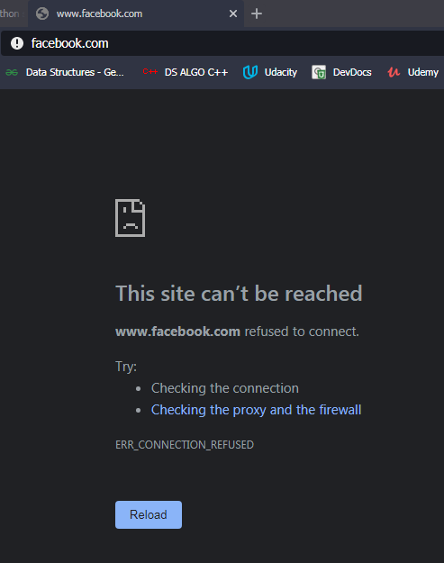

# Distraction Remover

Have you ever been distracted while working in your latest project and found yourself on social media and ended up wasting like 4 hours mindlessly scrolling? Then this is the solution for you.

## Table of contents

* [General info](#general-info)
* [Screenshots](#screenshots)
* [Setup](#setup)
* [To-Do List](#todo-list)
* [Status](#status)
* [Contact](#contact)

## General info

This python script blocks the websites you enter into it during the hours specified by you and shows that the site was unable to connect because it is blocked by a firewall. (Screenshots below. Works on Mac, Linux and Windows.)

## Screenshots



## Setup

* Clone the repository in whichever way you prefer
* Navigate to the directory
* If you are on Linux or Mac, open the terminal and write
```
sudo python3 main.py
```
* If you are on windows run a cmd windows as administrator and then write
```
python main.py
```

* The program will guide you on what to do next

* After you are finidhed entering the stuuf, try to open the websites that you had typed in and see the magic happen

* After the time you had entered is over, the site can be accessed again

## TODO list

* Find a better way to execute on Windows platform

* Add a GUI and run the program in the background

## Status

Project is:      _finished_

## Contact

Created by [@Maulik Shah](https://www.iammaulik.gtihub.io/site/) - feel free to contact me!
